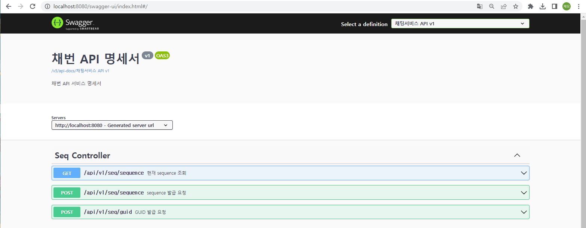
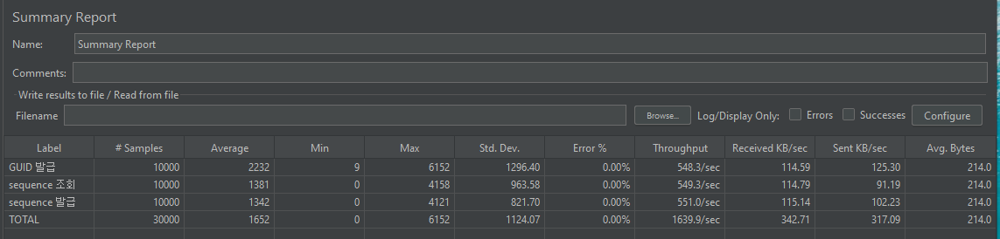
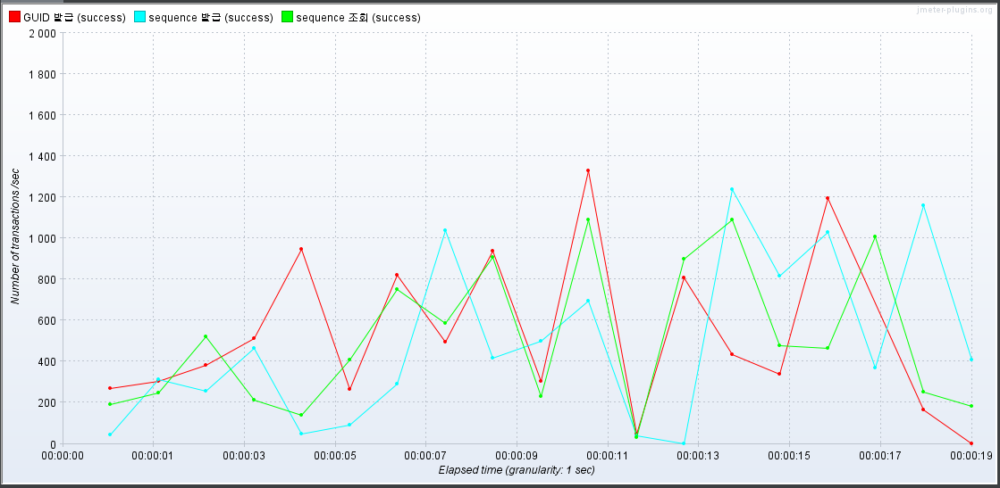
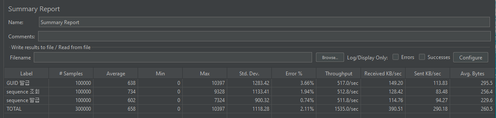
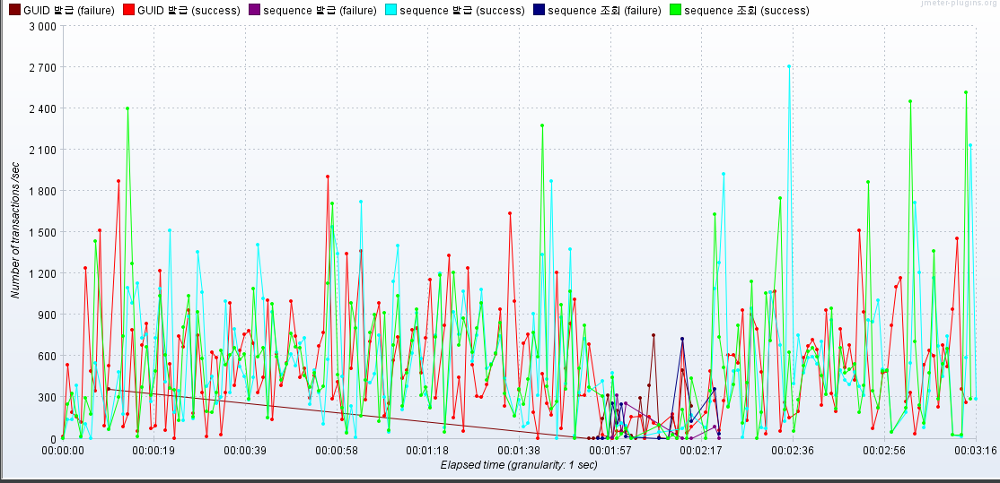
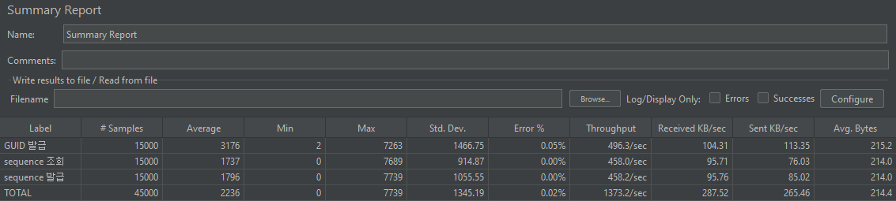
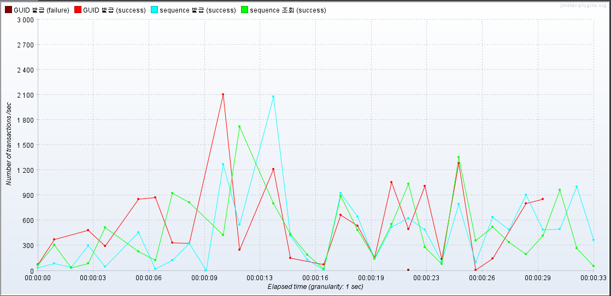
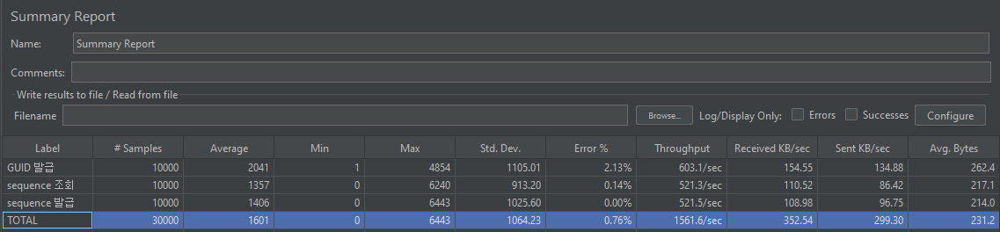
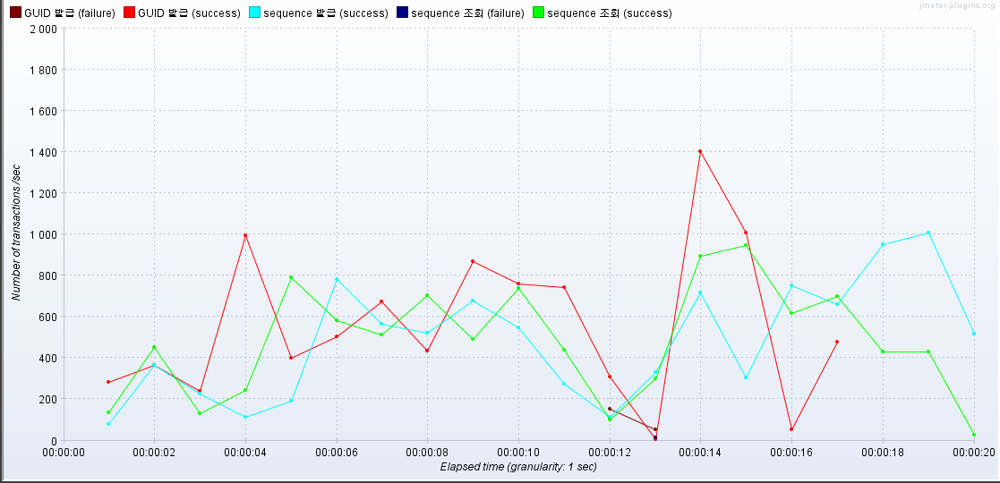

# Spring boot 

> Import API list

```
    [framework]
    spring-boot-starter-web
    
    [docs]
    org.springdoc

    [auth]
    spring-boot-starter-security
    io.jsonwebtoken

    [db]
    spring-boot-starter-data-jpa
    com.h2database
```

> 어플리케이션 기동 스크립트
```
  executable jar 형태로 seq/target 폴더에 build 된 상태
  
  windows 환경 start.bat 실행
  linux 환경 start.sh 실행
```

> Project Map

```
- seq
  + common                  … exception/auth 
    + auth                  … spring security custom handler, jwt
    + exception             … custom exception handler 
  + config                  … config(cors/jpa/profile/security/swagger)
  + data                    … data
    + dao                   … database access
    + dto                   … layer간 data 전송 객체 
    + entity                … database table
    + repository            … jpa repository interface 
  + service                 … spring service layer
  + web                     … spring controller layer
  - SeqApplication.java     … Entry Point.
  ```

> wiki

 - [spring security session](https://github.com/jaemocho/seq/wiki/Spring-Security-%EC%A0%81%EC%9A%A9)
 - [spring security jwt](https://github.com/jaemocho/seq/wiki/Spring-Security-JWT)
 - [profile 설정](https://github.com/jaemocho/seq/wiki/profile-%EB%B6%84%EB%A6%AC)

> 어플리케이션 build

  0. 사전 준비 
  ```
    maven_home(3.8.7)/java_home(17) 설정

    ※. mvnw --version 결과

    Apache Maven 3.8.7 (b89d5959fcde851dcb1c8946a785a163f14e1e29)
    Maven home: C:\Users\조재모\.m2\wrapper\dists\apache-maven-3.8.7-bin\678cc9d4\apache-maven-3.8.7
      Java version: 17.0.6, vendor: Eclipse Adoptium, runtime: C:\Users\조재모\.vscode\extensions\redhat.java-1.16.0-win32-x64\jre\17.0.6-win32-x86_64
      Default locale: ko_KR, platform encoding: MS949
      OS name: "windows 10", version: "10.0", arch: "amd64", family: "windows"
  ```
  
  1. 빌드 

  ```
    pom.xml 이 있는 위치(seq 폴더)에서 "mvnw clean package" 실행 
  ```

  2. 확인
  ```    
    seq/target 폴더에 seq-0.0.1-SNAPSHOT.jar 생성 확인 
  ```


> API Test (swagger)

 - application 기동 후 아래 page 접속 
 - http://localhost:8080/swagger-ui/index.html#/ 

    


> 성능 테스트(API 서버의 최대 처리량을 산정)

```
  사용 tool : jmeter 
  server & client spec  : Intel(R) Core(TM) i5-7200U CPU @ 2.50GHz 2.71 GHz, 8.00GB
   (한 pc내에서 수행)
  최대 처리량 : 1000~1500 tps         
```

- 10초간 1만 request(초당 1000 request) - [success]

  
  

- 100초간 10만 request(초당 1000 request) -  [fail] socket 관련 오류 전체의 2%

  
  

- 10초간 1.5만 request(초당 1500 request) - [success]

  
    


- 5초간 1만 request(초당 2000 request) - [success]

  
      


   


