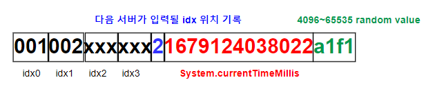

# 채번 API 서버

> 요구사항 

~~구상한 GUID/sequence 설명~~

~~어플리케이션 기동 스크립트를 작성해 주시고, 기동 방법을 기재해 주세요.~~

~~구현하신 채번 API 서버의 최대 처리량을 산정하고, 그 근거를 함께 제출해 주세요.~~

~~테스트 방법도 함께 작성해 주세요.~~

~~오픈 소스와 사용한 명세, 사용 목적 등을 명시해 주세요.~~

~~가용성 확보를 위한 구성 방안을 제출해 주세요.~~

~~build script 작성~~ 


> 사용 open source list

```
    springframework : web service framework, JPA/ORM
    h2database      : database, Sequnce 생성 및 동시성 보장(file db로 사용)
    springdoc       : swagger, api 문서 자동화
```

> 어플리케이션 기동 스크립트
```
  executable jar 형태로 seq/target 폴더에 build 된 상태
  
  windows 환경 start.bat 실행
  linux 환경 start.sh 실행
```

> 어플리케이션 build

  0. 사전 준비 
  ```
    maven_home(3.8.7)/java_home(17) 설정

    ※. mvnw --version 결과

    Apache Maven 3.8.7 (b89d5959fcde851dcb1c8946a785a163f14e1e29)
    Maven home: C:\Users\조재모\.m2\wrapper\dists\apache-maven-3.8.7-bin\678cc9d4\apache-maven-3.8.7
      Java version: 17.0.6, vendor: Eclipse Adoptium, runtime: C:\Users\조재모\.vscode\extensions\redhat.java-1.16.0-win32-x64\jre\17.0.6-win32-x86_64
      Default locale: ko_KR, platform encoding: MS949
      OS name: "windows 10", version: "10.0", arch: "amd64", family: "windows"
  ```
  
  1. 빌드 

  ```
    pom.xml 이 있는 위치(seq 폴더)에서 "mvnw clean package" 실행 
  ```

  2. 확인
  ```    
    seq/target 폴더에 seq-0.0.1-SNAPSHOT.jar 생성 확인 
  ```


> GUID 

  - GUID 구성 

    - 앞에 13자리는 지나온 서버를 의미, request 시 마다 guid를 전달

    - 뒤에 17자리는 unique id발급을 위해 현재시간(밀리초) + 16진수 네 자리 랜덤 숫자


  - unique 보장  

    - (밀리초) * (약 6만의 경우의 수) = 1,000 * 60,000 = 60,000,000 

    - 매 초 GUID 중복 발생 확률 1/60,000,000 

    - 초당 6천만 건 이상이 들어오면 중복 발생 가능 

    

    ```
    - 최대 네 개의 최근 server id 보관 (고유 id 각 3자리씩)
    
    - 13번째 자리는 다음 서버가 입력될 idx 위치를 기록 하며 업데이트 된다. 
      ex) 003 서버로 GUID가 이동되면 '001002003xxx31679124038022a1f1'
    
    - 4번째 서버가 입력된 뒤 추가로 입력이 되면 
      첫번째 서버가 삭제 되고 한칸씩 앞으로 당겨진다. 
      ex) 003, 004 서버로 GUID가 이동되면 '00100200300441679124038022a1f1'
        한번더 005 서버로 GUID가 이동되면 '00200300400541679124038022a1f1'
    ```
> Sequence
  - 다수의 서버에서 하나의 Sequence를 사용할 수 있게 h2 db를 선택 

    - 날짜별 관리를 위해 날짜/현재까지 발급된 Sequence column 생성

      
  
  - sequence 동시성 제어를 위해 sequence 증가 시 select for update를 사용 

  - 현재 sequence 확인

    1. swagger를 통해 "현재 sequence 조회" 수행 

    2. http://localhost:8080/h2-console/ 에서 sequence 테이블 확인

      - 접속 정보

      


> API Test (swagger)

 - application 기동 후 아래 page 접속 
 - http://localhost:8080/swagger-ui/index.html#/ 

    

    - "현재 sequence 조회"/"sequence 발급 요청" param/body 없이 바로 실행 
      
      

    - "GUID 발급요청" 
      ```
        1) guid/fromServer 둘 다 있는 경우 
          guid 에 fromServer가 update되어 guid 발급
        2) guid만 있는 경우 
          guid에 NEW라는 값이 update되어 guid 발급
        3) fromServer 만 있는 경우 
          신규 guid가 생성 되고 fromServer가 첫번째 idx에 update되어 guid 발급 
        4) 둘 다 없는 경우 
          신규 guid가 생성 되고 NEW라는 값이 첫번째 idx에 update되어 guid 발급 
      ```
      
      


> 성능 테스트(API 서버의 최대 처리량을 산정)

```
  사용 tool : jmeter 
  server & client spec  : Intel(R) Core(TM) i5-7200U CPU @ 2.50GHz 2.71 GHz, 8.00GB
   (한 pc내에서 수행)
  최대 처리량 : 1000~1500 tps         
```

- 10초간 1만 request(초당 1000 request) - [success]

  
  

- 100초간 10만 request(초당 1000 request) -  [fail] socket 관련 오류 전체의 2%

  
  

- 10초간 1.5만 request(초당 1500 request) - [success]

  
    


- 5초간 1만 request(초당 2000 request) - [success]

  
      


> 가용성 확보를 위한 구성방안
- cluster 구성 
  - DemonSet 구성 
      
      - 장점 : 각 worker node에 구동되어있는 app에 바로 접근하여 network i/o 이슈가 덜하다.  
      
      - 단점 : 모든 worker node에 구동되어있어서 자원 소모가 크다. 

    
  
  - DeploymentSet 구성
      
      - 장점 : hpa를 이용하면 요청량에 따라 자원을 적절하게 사용할 수 있다. 
      
      - 단점 : 모든 worker node가 같은 LAN 구간에 있지 않는 경우 network i/o 이슈가 발생할 수 있다. 

    

- on premise 구성

    

    - 장점 : 기본적인 구성, 구성이 단순, cluster 환경에 대한 유지보수 필요 없음  
    
    - 단점 : 사용량에 따른 확장이 어려움, app 관리를 수동으로 진행
